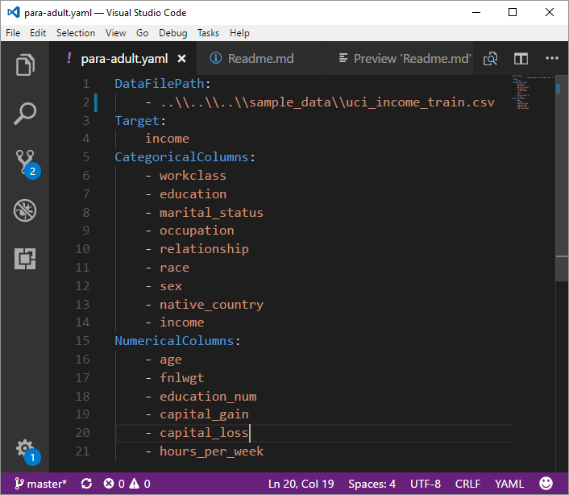

# /code/01\_data\_acquisition\_and\_understanding\/IDEAR

## How IDEAR utility is run for UCI Income data
Documentation on how to use IDEAR in Python 3 is available in detail [here](https://github.com/Azure/Azure-TDSP-Utilities/blob/master/DataScienceUtilities/DataReport-Utils/Python/readme.md). 

In your Azure Machine Learning project in Windows Data Science Virtual Machine (DSVM), double-click on the IDEAR.ipnb in: .\code\01_data_acquisition_and_understanding\IDEAR\

Then click on Start Notebook:

The notebook starts Python 3 kernel. Then you can run the notebook cell-by-cell by using the '>|' run button on the top, or using the drop down "Cell" menu from the top, and selecting "Run All", which will run the entire notebook.

You may get some errors during importing libraries. If there are missing libraries (eg.g. matplotlib, seaborn etc.), then open the Azure Machine Learning command line from the "File" menu of the Azure Machine Learning workbench, and then install those libraries:

    pip install matplotlib
    pip install seaborn

### Primary IPython Notebook file
**IDEAR.ipynb**: 
This is the primary IPython notebook file, which when executed provides the interactive plots and summaries, which can subsequently saved as a standardized data exploration report.

### Settings YAML file
**para-adult.yaml**: 

This is the settings file for IDEAR.ipnb. This specifies location of input data file, numerical, and categorical variables etc.

