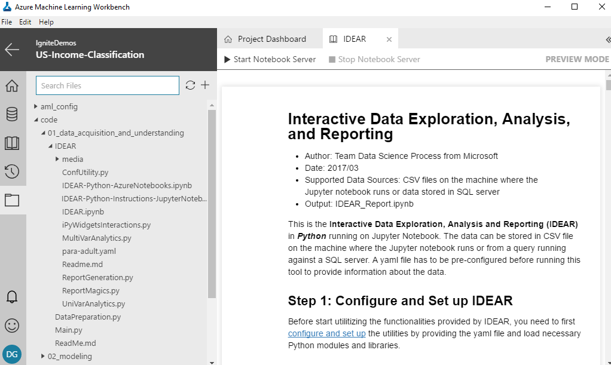

# /code/01\_data\_acquisition\_and\_understanding\/IDEAR

## How IDEAR utility is run for UCI Income data
Documentation on how to use IDEAR in Python 3 is available in detail [here](https://github.com/Azure/Azure-TDSP-Utilities/blob/master/DataScienceUtilities/DataReport-Utils/Python/readme.md). 

In your Azure Machine Learning project in Windows Data Science Virtual Machine (DSVM), double-click on the IDEAR.ipnb in: .\code\01_data_acquisition_and_understanding\IDEAR\

Then click on Start Note

The notebook will start Python 3 kernel. Then you can run the notebook cell-by-cell by using the '>|' run button on the top, or using the drop down "Cell" menu from the top, and selecting "Run All", which will run the entire notebook.

### Primary IPython Notebook file
**IDEAR.ipynb**: 

### Settings YAML file
**para-adult.yaml**: 

