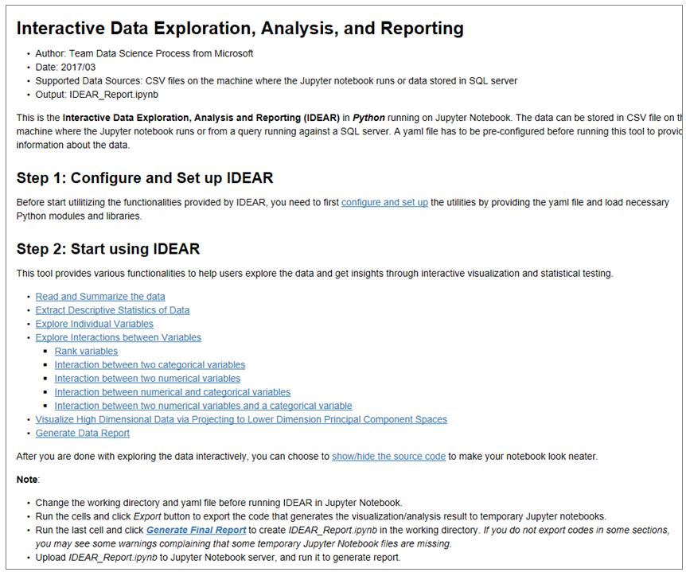
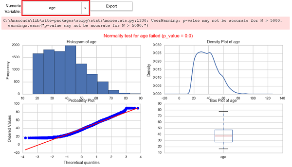

# /code/01\_data\_acquisition\_and\_understanding\/IDEAR

## How IDEAR utility is run for UCI Income data
Documentation on how to use IDEAR in Python 3 is available in detail [here](https://github.com/Azure/Azure-TDSP-Utilities/blob/master/DataScienceUtilities/DataReport-Utils/Python/readme.md). 

In your Azure Machine Learning project in Windows Data Science Virtual Machine (DSVM), double-click on the IDEAR.ipnb in: .\code\01_data_acquisition_and_understanding\IDEAR\

Then click on Start Notebook:

The notebook starts Python 3 kernel. Then you can run the notebook cell-by-cell by using the '>|' run button on the top, or using the drop down "Cell" menu from the top, and selecting "Run All", which will run the entire notebook.

### Primary IPython Notebook file
**IDEAR.ipynb**: 
This is the primary IPython notebook file, which when executed provides the interactive plots and summaries, which can subsequently saved as a standardized data exploration report.

Briefly, you will need to double-click on the IDEAR.ipnb IPython notebook. Then click on "Start Jupyter Notebook Server" at the top, and then run the entire notebook.  Then interactively change certain settings for data exploration or plotting. And, finally output a final report from it. The final report will saved in docs/deliverable_docs folder.

### Settings YAML file
**para-adult.yaml**: 

This is the settings file for IDEAR.ipnb. This specifies location of input data file, numerical, and categorical variables etc.

### IDEAR Report
Report from IDEAR is in ./docs/deliverable_docs/IDEAR.html. It can be one of the deliverables to your client. 

An example image from that report is given below. This figure shows disrribution of one of the numerical features (age). The red box indicates that  you can change this feature to another numerical feature to get distribution properties.

