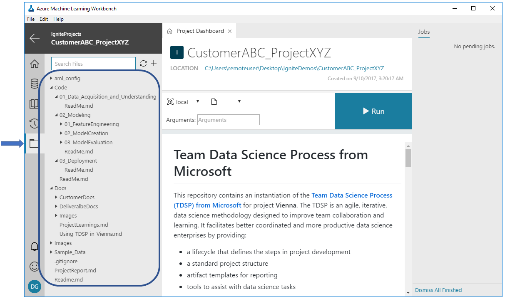

## Link of the Gallery GitHub repository
Following is the link to the public GitHub repository: 

https://github.com/Azure/MachineLearningSamples-TDSPUCIAdultIncome

We provide summary documentation here about the sample. More extensive documentation can be found on the GitHub site.

## Prerequisites
1. Please make sure that you have properly installed Azure ML Workbench by following the [installation guide](https://github.com/Azure/ViennaDocs/blob/master/Documentation/Installation.md).
2. For operationalization, it is best if you have Docker engine installed and running locally. If not, you can use the cluster option but be aware that running an (ACS) Azure Container Service can be expensive.
3. This tutorial assumes that you are running Azure ML Workbench on Windows Server 10 with Docker engine locally installed. If you are using macOS the instruction is largely the same.

## Introduction

Standardization of the structure, lifecycle, and documentation of data science projects is key to facilitating effective collaboration on data science teams. Creating Azure Machine Learning Workbench projects with the TDSP template provides a framework for coordinated teamwork.

We had previously released a [GitHub repository for the TDSP project structure and templates](https://github.com/Azure/Azure-TDSP-ProjectTemplate) to help achieve these objectives. But it was not possible, until now, to instantiate the TDSP structure and templates within a data science tool. It is now possible to create an Azure Machine Learning Workbench project that is instantiated with [TDSP structure and documentation templates](https://github.com/amlsamples/tdsp). Instructions on how to use TDSP structure and templates in Azure Machine Learning Workbench is provided [here](https://github.com/amlsamples/tdsp/blob/master/Docs/how-to-use-tdsp-in-azure-ml.md). Here we provide an example of how a project can be created using TDSP structure and executed in Azure Machine Learning Workbench.

### Purpose & Scope
The primary purpuse of this sample is to show how to instantiate and execute a data science projet using the [Team Data Science Process (TDSP)](https://github.com/Azure/Microsoft-TDSP) structure and templates in Azure Machine Learning Workbench.

 * Ths scope of this sample is to create a binary classification machine learning model which address the above rediction problem. 
 * We execute the project in Azure ML Workbench. We will use the Team Data Science Process template om Azure ML Workbench for this project. 
 * Finally, we operationalize the solution in Azure Container Servides for batch and single-mode scoring.

### Data 
The dataset for this sample is from the UCI ML Repository [[link]](https://archive.ics.uci.edu/ml/datasets/adult). It is taken from the 1994 US Census database and contains census and income information for about 50,000 individuals. This is a binary classification task with structured data having numerical and categorical features. 

## Use Case Overview
The problem is to understand how socio-economic data captured in US Census help predict income of individuals in US. Based on such census features, the machine learning task is to predict if the income of an individual is above $50,000 or not (binary classification task).

## Data Description
For detailed information about the data, please see the [description](https://archive.ics.uci.edu/ml/machine-learning-databases/adult/adult.names) in the UCI repository. 

This data was extracted from the census bureau database found at: http://www.census.gov/ftp/pub/DES/www/welcome.html. 

There are a total of 48,842 instances (prior to any filtering), mix of continuous and discrete (train=32561, test=16281)

Probability for the label '>50K'  : 23.93% / 24.78% (without unknowns)

Probability for the label '<=50K' : 76.07% / 75.22% (without unknowns)

TARGET: Income class >50K, <=50K.

FEATURES: Age, work class, education level, education level, race, sex, hours of work per week, etc.

## Scenario Structure and Reporting

### Structure
For this project, we folllow the TDSP folder structure and documentation templates (Figure 1), which follows the [TDSP lifecycle](https://github.com/Azure/Microsoft-TDSP/blob/master/Docs/lifecycle-detail.md).

 

The step-by-step workflow is as follows:
1. **Data Acquisition and Understanding**
2. **Modeling**
3. **Deployment**

### Reporting
Details about each of the above sections are provided in the project report [ProjectReport](https://github.com/Azure/MachineLearningSamples-TDSPUCIAdultIncome/ProjectReport.md). The project report also contains further details about the use case, model performance metrics, deployment, and infrastructure.

## Conclusion & Next Steps

In this sample, we showed now to use TDSP structure and templates in Azure Machine Learning Workbench. We hope you will use this template to fcilitate with project structure standardization within your data science teams.

## References

Team Data Science Process (TDSP):  https://github.com/Azure/Microsoft-TDSP
TDSP project template for Azure Machine Learning Workbench: https://github.com/amlsamples/tdsp 

## Contact

Please feel free to contact Debraj GuhaThakurta (debraj.guhathakurta@microsoft.com) or Xibin Gao (xibingao@microsoft.com) with any question or comments.

## Disclaimer

Leave this session as what it is for now. We will update the content once we get more concrete answers from the legal team.